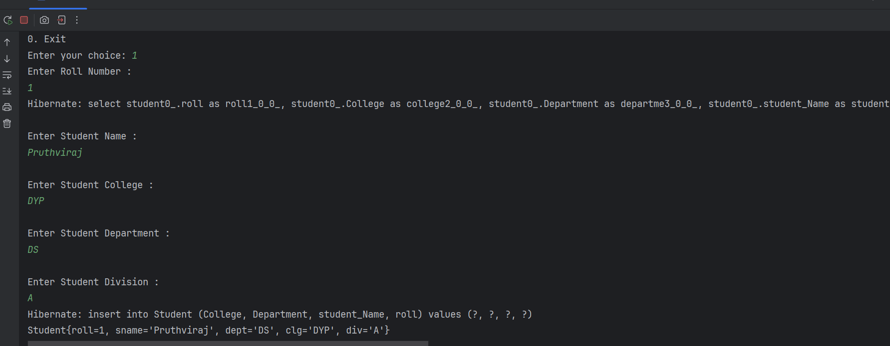
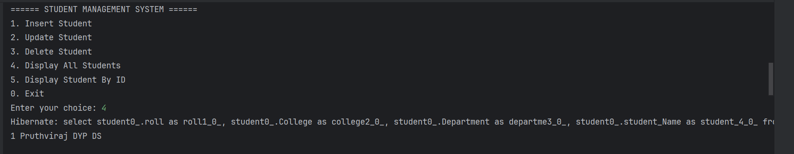
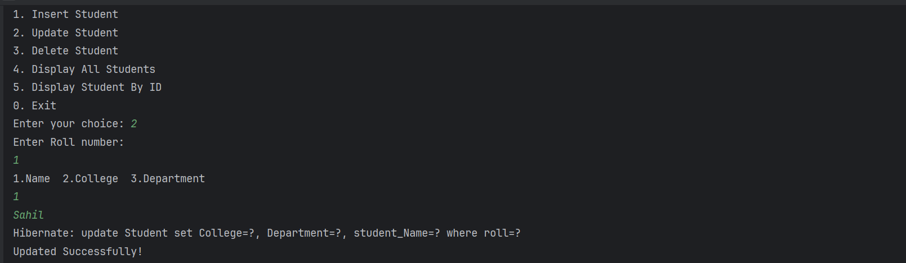
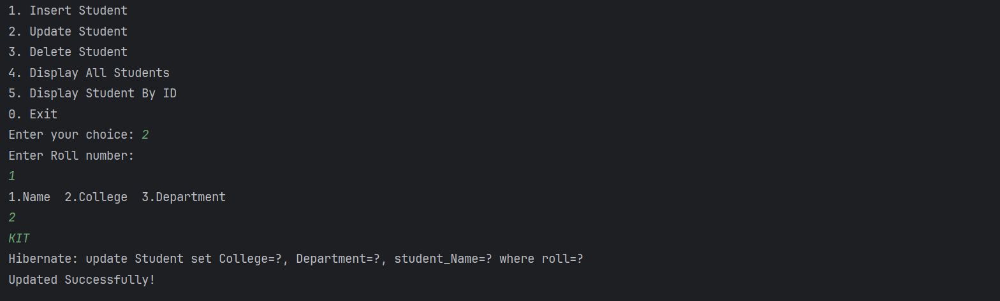
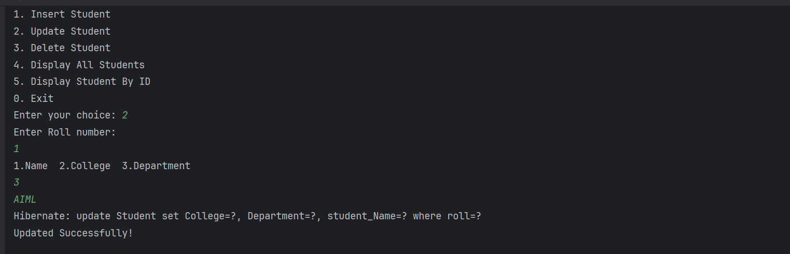

# 📘 Student Management System (Hibernate + Java)

## 📌 Overview

This is a **console-based Student Management System** built using **Java and Hibernate ORM**.
It allows users to perform basic **CRUD (Create, Read, Update, Delete)** operations on student records stored in a database.

---

## 🚀 Features

* Insert new student records
* Update existing student details
* Delete student records
* Display all students
* Fetch a student by ID
* Menu-driven console interface

---

## 🛠️ Technologies Used

* Java (JDK 17+)
* Hibernate ORM
* MySQL Database
* Maven (for dependency management)

---

## 📂 Project Structure

```id="proj123"
org.example
│── Main.java                # Entry point
│
├── entity
│   └── Student.java         # Entity class
│
└── utils
    └── CRUDOps.java         # CRUD logic
```

---

## ⚙️ Configuration

* Configure `hibernate.cfg.xml`
* Set database credentials (URL, username, password)
* Add MySQL dependency in `pom.xml`

---

## ▶️ How to Run

1. Clone the repository
2. Open in IntelliJ IDEA / Eclipse
3. Configure database
4. Run `Main.java`

---

## 🖼️ Screenshots


### 📌 Insert Student




### 📌 Display All Students




### 📌 Display Student By ID


### 📌 Update 







## 👨‍💻 Author

Pruthviraj Patil

---
